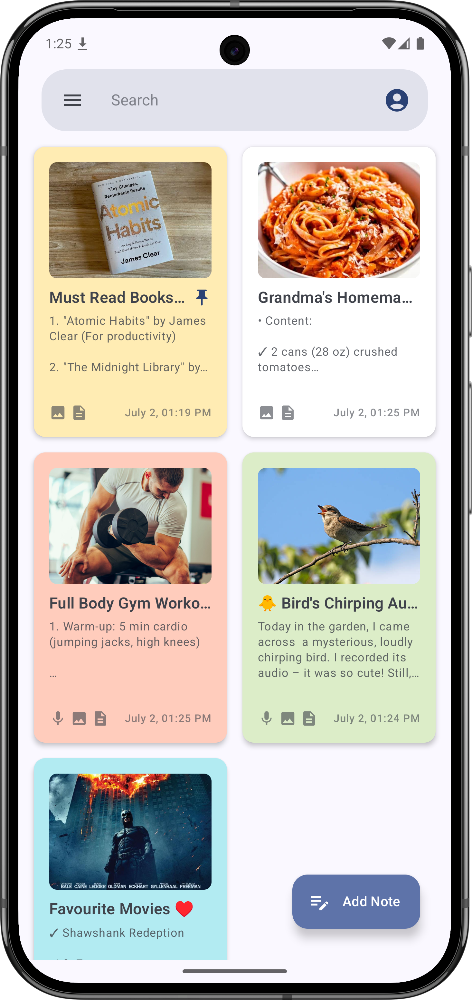
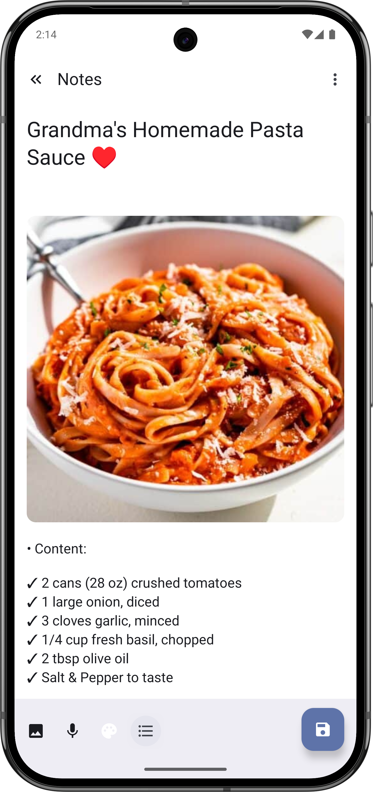
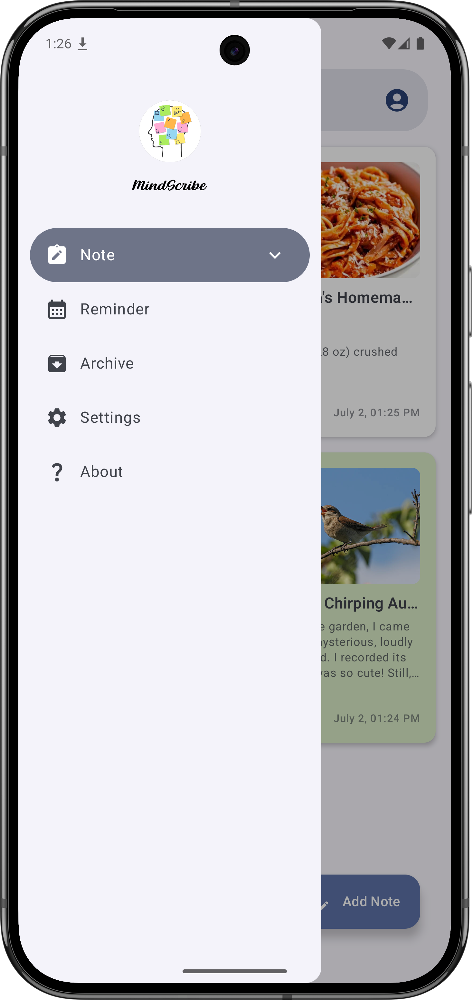
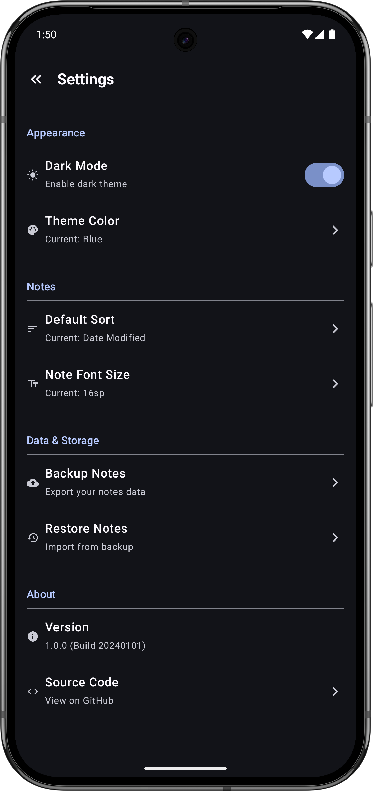
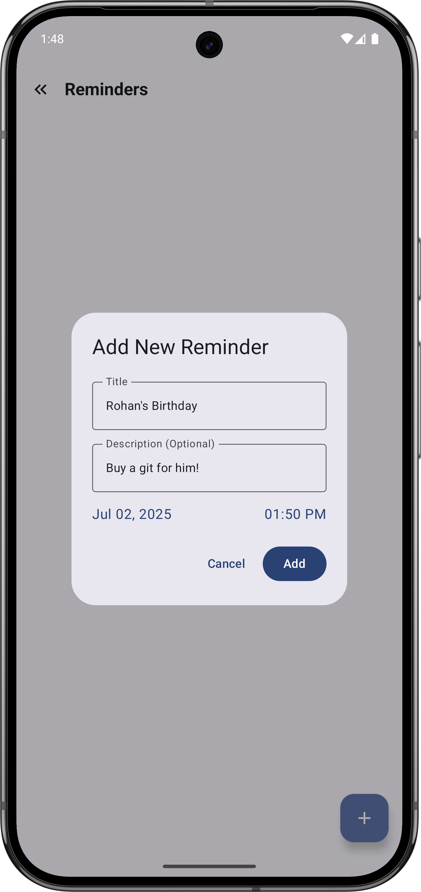
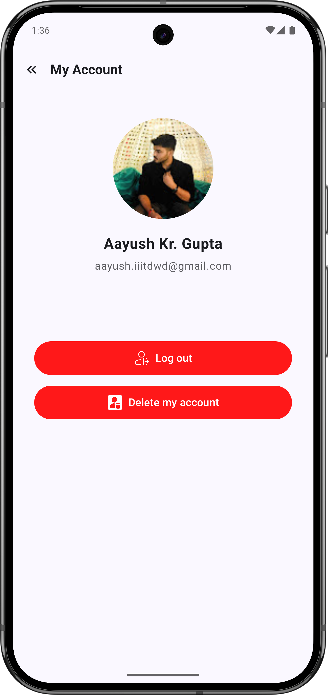
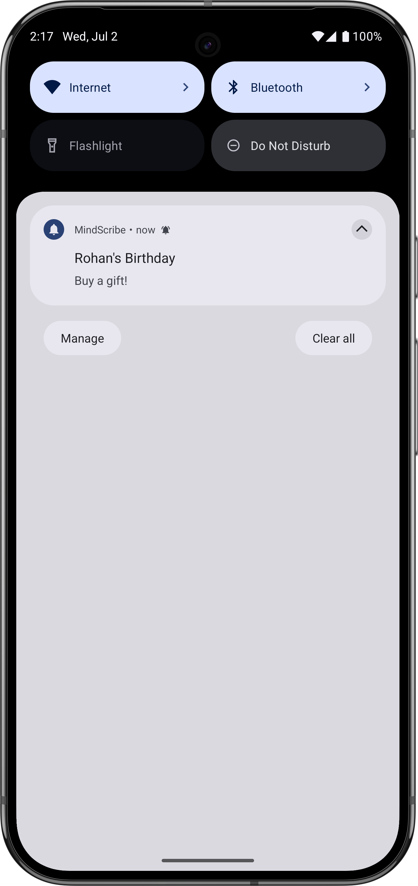
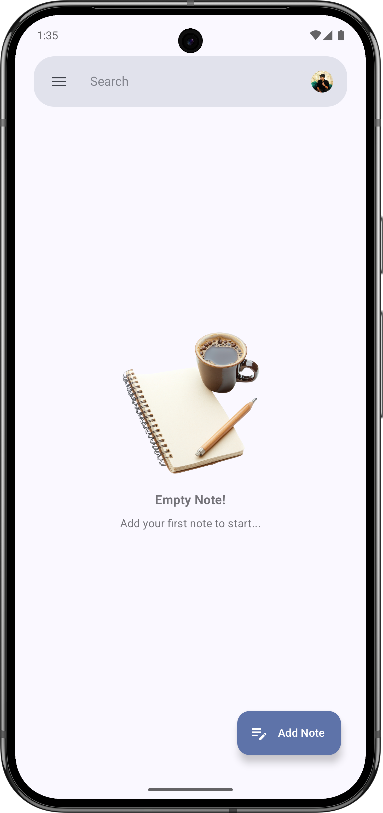
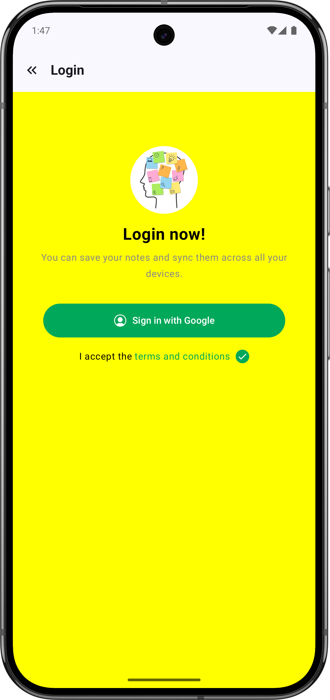

# 
MindScribe

  

<h3 align="center" style="font-style: italic; color: #555;">Your Thoughts, Synchronized</h3>

MindScribe is a sophisticated, user-centric note-taking application engineered for seamless capture, organization, and synchronization of your thoughts. Crafted with the latest **Jetpack Compose** for a fluid and intuitive user interface, MindScribe leverages **Firebase Authentication** for secure user management and **Cloud Firestore** for real-time, multi-device data synchronization, ensuring your notes are always up-to-date and accessible.

## 📱 App Screenshots

  
  
  

  
  
  

  
  
  

  
  
  

## ✨ Core Features & Functionality

MindScribe offers a rich set of features designed to enhance your note-taking experience:

* **Robust User Authentication**:
    * **Secure Sign-Up & Login**: Built upon Firebase Authentication, offering robust email/password authentication for personalized and protected access.
    * **Persistent Sessions**: Users remain logged in across app launches for a continuous and convenient experience.
* **Seamless Cloud Synchronization & Offline Access**:
    * **Cloud Firestore Integration**: Your notes are automatically synchronized with Cloud Firestore in real-time, allowing access from any device where you're logged in.
    * **Offline-First Architecture**: Leveraging Room Database, MindScribe provides full note management capabilities even without an internet connection. Changes made offline are automatically synchronized once connectivity is restored.
    * **Data Backup**: Your valuable notes are securely stored in the cloud, protecting against data loss.
* **Comprehensive Note Management**:
    * **Full CRUD Operations**: Effortlessly Create, Read, Update, and Delete notes.
    * **Pinning Important Notes**: Keep your most crucial thoughts just a tap away by pinning them to the top of your home screen.
    * **Efficient Archiving**: Declutter your main workspace by archiving notes that are completed or less frequently accessed, without deleting them permanently.
    * **Intelligent Search**: Quickly locate any note using the integrated search functionality that filters by title and content.
* **Rich Content & Customization**:
    * **Audio Notes (If implemented)**: Capture spontaneous ideas or lectures by attaching audio recordings directly to your notes.
    * **Image Integration (If implemented)**: Enhance your notes with visual context by embedding images within them.
    * **Customizable Note Colors**: Personalize your notes with a variety of color options, aiding in visual organization and categorization.
* **Intuitive & Modern User Interface**:
    * **Jetpack Compose & Material Design 3**: Experience a beautiful, responsive, and cutting-edge UI built with Android's modern declarative toolkit and the latest Material Design guidelines.
    * **Effortless Navigation**: A well-structured Navigation Drawer provides quick access to Home, Archived Notes, Pinned Notes, Account Details, Settings, and more.
    * **Dedicated Account Screen**: A specialized screen to view authenticated user details and manage your session (sign out).
* **System Integrations**:
    * **Runtime Permissions**: Graceful handling of Android runtime permissions, such as requesting microphone access for audio recording when needed.
    * **Custom Splash Screen**: A polished, brand-aligned splash screen ensures a smooth and engaging app launch experience.

## 🚀 Tech Stack

MindScribe is built on a robust and modern technology stack:

* **Language**: **Kotlin** - A concise, safe, and interoperable programming language for Android development.
* **UI Framework**:
    * **Jetpack Compose**: Android's modern toolkit for building native UI.
    * **Material Design 3**: Implementing Google's latest design system for a beautiful and consistent user experience.
* **Navigation**:
    * **Jetpack Compose Navigation**: Managing in-app screen transitions and argument passing.
* **Architecture**:
    * **MVVM (Model-View-ViewModel) Pattern**: Separating concerns for better testability and maintainability.
    * **Android Architecture Components**: Leveraging `ViewModel`, `LiveData`, and `StateFlow` for robust state management and lifecycle awareness.
* **Data Storage & Backend**:
    * **Room Persistence Library**: An abstraction layer over SQLite for local, offline data persistence.
    * **Firebase Authentication**: For secure user sign-up, login, and session management.
    * **Cloud Firestore**: A flexible, scalable NoSQL cloud database for real-time data synchronization across devices and secure backend storage.
* **Asynchronous Operations**:
    * **Kotlin Coroutines**: For efficient and non-blocking background operations.
    * **Kotlin Flow**: For handling asynchronous data streams, especially with Room and Firestore.
* **System Utilities**:
    * **Android 12+ Splash Screen API (`androidx.core:core-splashscreen`)**: For native splash screen integration.
    * **Android Runtime Permissions**: For managing sensitive app permissions (e.g., `RECORD_AUDIO`).
* **Build System**: **Gradle Kotlin DSL** - For type-safe and more readable build configurations.

## 🏗️ Project Structure

The MindScribe project adheres to a clean and modular Android project structure, enhancing readability, testability, and scalability:
